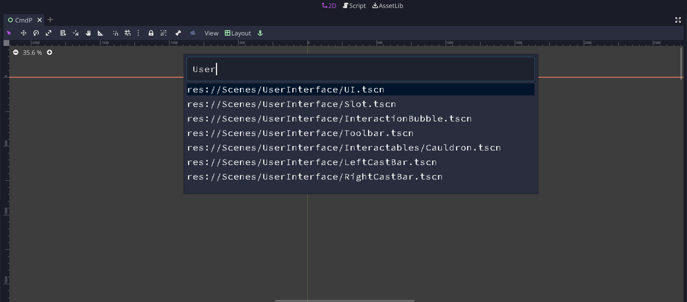

# Godot Scene Search and Open

This tool recreates the file search functionality from VS Code, to search for
scenes in the Godot Editor. It's called CmdP because on a Mac, that is the hotkey
in VSCode.

The hotkey for bringing this up is Cmd+P on a mac, or Ctrl+P on Windows/Linux.
Once the window is brought up, type in characters to start searching for the scene
that you want to open. If the top scene is not the one you are looking for, you
can go through the list by using the up and down arrows. Then just press Enter
when the desired entry is selected, and the scene will be opened. If you changed
your mind, just hit escape, and the window will close.

All of the hotkeys use the following input maps:

- up arrow => `ui_up`
- down arrow => `ui_down`
- enter => `ui_accept`
- escape => `ui_cancel`
- cmd/ctrl+p => `ui_file_search`

## Known Issues

None so far :)
